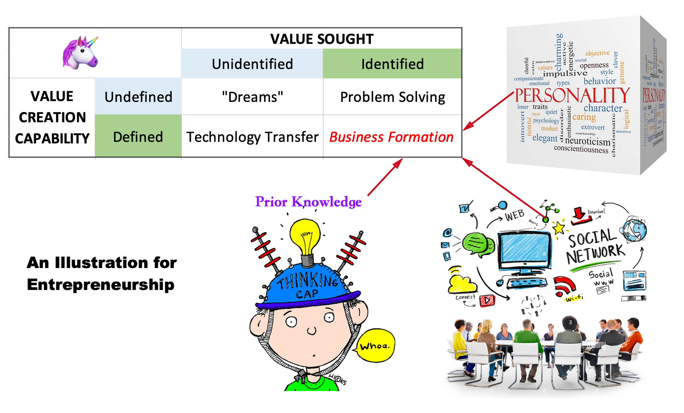

# Entrepreneurship Conference

Today I attended an entrepreneurship conference and practiced the skills of
networking there. This conference was organized by an organization called
'founder's club' in Frankfurt. There were around 200 people in this conference,
whom could be divided into the following groups:

* young start-ups
* venture capital firms
* consult firms for helping young start-ups
* government agency to promote innovation
* students or young professions who are looking for jobs 

After talking with many people there, I had some reflections and would like to
share what I have learned there. 

## A picture is worth a thousand words

## The institution factor

They say that good business starts with right people at the right time and
in a right place. With right people, you can have a good team and make your 
business to run. At the right time, you can get head of your competitors and sell
your products or services to your customers when they want. In a right place,
you can pull all relevant resources in a lower cost to produce and deliver. 

After chatting with people in the conference, I would say that people who have
a start-up related to the car industry might have a higher chance to win out
in Germany than that in other countries. Same for start-ups of doing IT in 
silicon valley.

One could have a small firm in a decent city. However, big firms are more likely
from innovative cities like San Francisco or Shenzhen. 

In summary, _do what you can, with what you have, where you are_. 
