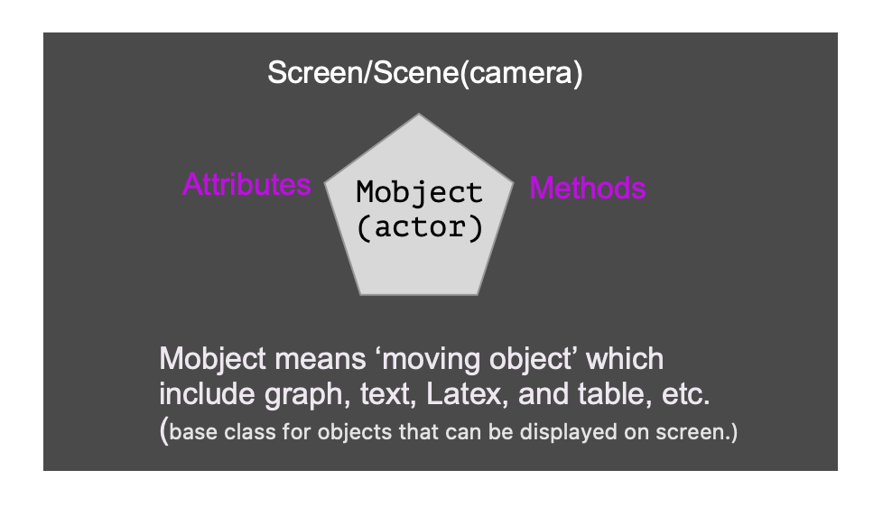

# Scene and Mobject 


## Big picture 

A movie is made by different `scenes` and a scene is made by different kinds 
of `Mobject`s(moving objects). To create a scene we need to `create` or `add`
`Mobject`. 

Everything starts with the following `class`:

```py
class MovieName(Scene):
    def construct(self):
        # here you create your animation world
```

You could take `Scene` as your __camera__ or your background video which is waiting
for you to act. But who is the __actor__? In our engine, the actor is called
`Mobject` which is the most important element (we call it `base class`). 
The following figure gives the big picture. 




Every time when you want to create a movie, you need to do the following
three steps:

1. set up the `Scene`
2. create the `Mobject`
3. call animation `method` to make `Mobject` to move

Sometimes, you might need to zoom in or zoom out with your `camera`, which
we will cover those advanced topics in detail later. 

## Set up the `Scene` 

To set up the scene, you just need to import the `manim` package and create
an inherited class from `Scene`. 

```py
from manim import *   # import 


class YourVideoName(Scene):
    def construct(self):
        # your code starts here 
```

## Create the `Mobject`

A _moving object_ is a base class that could engine your animation. For instance,
a simple animation is to make a photo fly in from the left to the right. Then,
a photo is a _moving object_. In `manim`, `ImageMobject` could read an image
and make it as a moving object. 

```python
img = ImageMobject("images/cuteguy1.png")
img.scale(0.8)
img.shift(LEFT*5)
self.play(img.animate.shift(RIGHT*5), run_time=2)
```

There are many _moving objects_ in `manim`, here is the link:

* `frame`: Special rectangles.
* `geometry` - Various geometric Mobjects.
* `graph` - Mobjects used to represent mathematical graphs (think graph theory, not plotting).
* `graphing` - Coordinate systems and function graphing related mobjects.
* `logo` - either the logo from the package or created by yourself (Utilities for Manim's logo and banner).
* `matrix` - Mobjects representing matrices.
* `mobject` -  Base classes for objects that can be displayed.
* `svg` - Mobjects related to SVG images.
* `table` -  Mobjects representing tables.
* `text` - Mobjects used to display Text using Pango or LaTeX.
* `three_d` - Three-dimensional mobjects.
* `types` - Specialized mobject base classes.
* `value_tracker` - Simple mobjects that can be used for storing (and updating) a value.
* `vector_field` - Mobjects representing vector fields.

## Call animation `method` 

