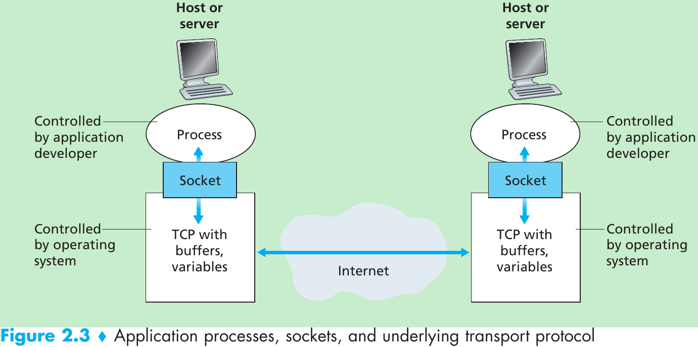
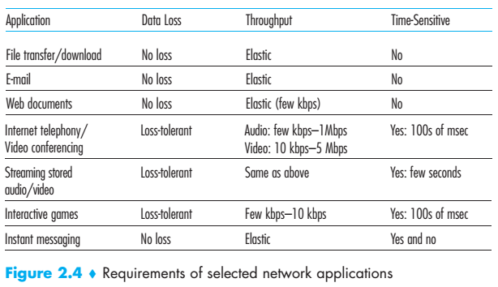
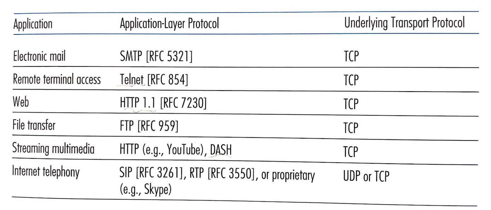

# Application Layer


In this post, we study the conceptual and implementation aspects of network
applications. At this stage, we will focus on learning how protocols will
be used to __process__ information on the internet. 

Keep in mind that _an application's architecture is distinctly different from
the network architecture_. From the application developer's perspective, the
network architecture is fixed and given. There are two kinds of application
architecture: __client-server architecture__ and __peer-2-peer (P2P) architecture__. 


## Client and Server Processes 

In the context of a communication session between a pair of processes, the
process that __initiates__ the communication (that is, initially contacts the 
other process at the beginning of the session) is labeled as the _client_. The
process that __waits__ to be contacted to begin the session is the _server_. 

This gives the asymmetric interaction structure between clients and servers, which
has many implications when you think about our digital economy. 

A process sends messages into, and receives messages from, the network through 
a software interface called a __socket__. It is also referred to as the
__Application Programming Interface (API)__ between the application and the
network. 



To identify the receiving process, two pieces of information need to be
specified: (1) the address of the host and (2) an identifier that specifies
the receiving process in the destination host, which corresponds:

* __IP address__: 32/64-bit quantity for identifying the host
* __port number__: managing applications (such as 80 for Web server and 25 for SMTP)

The internet does not guarantee a reliable data transfer. Programmers need to
decide whether they will use __reliable data transfer__ or __loss-tolerant application__. 



The __TCP__ service model includes a connection-oriented service and a _reliable_
data transfer service, whereas __UDP__ is a no-frills, lightweight transport
protocol and provides an _unreliable_ data transfer service.




## The Web and HTTP 

In the early 1990s, [Tim Berners-Lee](https://en.wikipedia.org/wiki/Tim_Berners-Lee)
invented the __World Wide Web__. The Web operates _on demand_, which means
users receive what they want, when they want it. Many applications on the Internet
are based on web technology, such as search engine, YouTube, and Instagram. At 
the heart of the Web, it is the __HyperText Transfer Protocol (HTTP)__, the web's
application-layer protocol. 

A __Web page__ consists of objects. An __object__ is simply a file - such as 
HTML file, a JPEG image, a Javascript file, a CSS (Cascading Style Sheets) file
or a video clip - that is addressable by a single Uniform Resource Locator (URL).
Most web pages consist  of a __base HTML file__ and several referenced objects. 
It is important to know those terms by your heart:

* __Hypertext__ is text displayed on a computer display or other electronic devices with references (hyperlinks) to other text that the reader can immediately access.
* __HTTP__: HyperText Transfer Protocol
* __HTML__: HyperText Markup Language 
* __URL__: Uniform Resource Locator
* A __web browser__ (also referred to as an Internet browser or simply a browser) is application software for accessing the World Wide Web or a local website.

Now, let's visit the __first website__ in this world by using `telnet`.

```ssh
telnet info.cern.ch 80
GET /hypertext/WWW/TheProject.html HTTP/1.0
Host: info.cern.ch
Connection: close
User-agent: Mozilla/5.0
Accept-language: en
```
Here is the response message from the server.

```ssh
HTTP/1.1 200 OK
Date: Fri, 17 Jun 2022 09:42:25 GMT
Server: Apache
Last-Modified: Thu, 03 Dec 1992 08:37:20 GMT
ETag: "8a9-291e721905000"
Accept-Ranges: bytes
Content-Length: 2217
Connection: close
Content-Type: text/html


<HEADER>
<TITLE>The World Wide Web project</TITLE>
<NEXTID N="55">
</HEADER>
<BODY>
<H1>World Wide Web</H1>The WorldWideWeb (W3) is a wide-area<A
NAME=0 HREF="WhatIs.html">
hypermedia</A> information retrieval
initiative aiming to give universal
access to a large universe of documents.<P>
Everything there is online about
W3 is linked directly or indirectly
to this document, including an <A
NAME=24 HREF="Summary.html">executive
summary</A> of the project, <A
NAME=29 HREF="Administration/Mailing/Overview.html">Mailing lists</A>
, <A
NAME=30 HREF="Policy.html">Policy</A> , November's  <A
NAME=34 HREF="News/9211.html">W3  news</A> ,
<A
NAME=41 HREF="FAQ/List.html">Frequently Asked Questions</A> .
<DL>
<DT><A
NAME=44 HREF="../DataSources/Top.html">What's out there?</A>
<DD> Pointers to the
world's online information,<A
NAME=45 HREF="../DataSources/bySubject/Overview.html"> subjects</A>
, <A
NAME=z54 HREF="../DataSources/WWW/Servers.html">W3 servers</A>, etc.
<DT><A
NAME=46 HREF="Help.html">Help</A>
<DD> on the browser you are using
<DT><A
NAME=13 HREF="Status.html">Software Products</A>
<DD> A list of W3 project
components and their current state.
(e.g. <A
NAME=27 HREF="LineMode/Browser.html">Line Mode</A> ,X11 <A
NAME=35 HREF="Status.html#35">Viola</A> ,  <A
NAME=26 HREF="NeXT/WorldWideWeb.html">NeXTStep</A>
, <A
NAME=25 HREF="Daemon/Overview.html">Servers</A> , <A
NAME=51 HREF="Tools/Overview.html">Tools</A> ,<A
NAME=53 HREF="MailRobot/Overview.html"> Mail robot</A> ,<A
NAME=52 HREF="Status.html#57">
Library</A> )
<DT><A
NAME=47 HREF="Technical.html">Technical</A>
<DD> Details of protocols, formats,
program internals etc
<DT><A
NAME=40 HREF="Bibliography.html">Bibliography</A>
<DD> Paper documentation
on  W3 and references.
<DT><A
NAME=14 HREF="People.html">People</A>
<DD> A list of some people involved
in the project.
<DT><A
NAME=15 HREF="History.html">History</A>
<DD> A summary of the history
of the project.
<DT><A
NAME=37 HREF="Helping.html">How can I help</A> ?
<DD> If you would like
to support the web..
<DT><A
NAME=48 HREF="../README.html">Getting code</A>
<DD> Getting the code by<A
NAME=49 HREF="LineMode/Defaults/Distribution.html">
anonymous FTP</A> , etc.</A>
</DL>
</BODY>
Connection closed by foreign host.
```

When we request, we could use __non-persistent connections__ or __persistent connections__.
The default mode of HTTP uses persistent connections with pipeline. 


__References__

[1] [Hyperlinked Text](https://sjmulder.nl/en/textonly.html) <br>
[2] [HTT](https://developer.mozilla.org/en-US/docs/Web/HTTP)

Kurose, J. F., & Ross, K. W. (2022). Computer Networking: A Top-Down Approach
Eight Edition. _Addision Wesley_.

???cite
    ```
    @article{kurose2022computer,
    title={Computer Networking: A Top-Down Approach Eighth Edition},
    author={Kurose, James F and Ross, Keith W},
    journal={Addision Wesley},
    year={2022}
    }
    ```