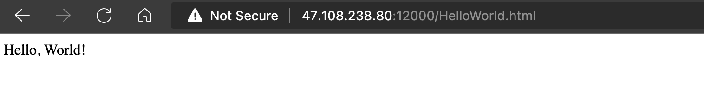
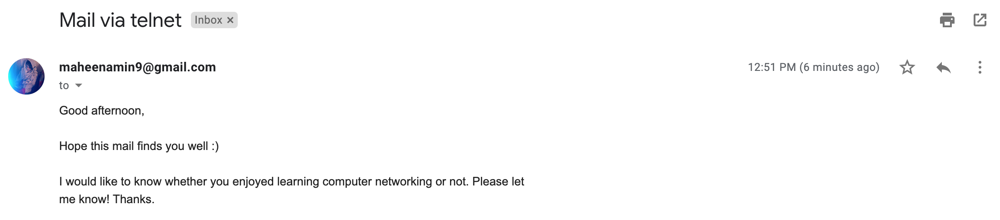

# Socket Programming

In this post, we will write simple client-server programs that use user
datagram protocol (UDP) and transmission control protocol (TCP). Recall that
TCP is connection oriented (meaning that the communicating devices should 
establish a connection before transmitting data and should close the connection
after transmitting the data.) and provides a reliable byte-stream channel.
However, UDP is connectionless and sends independent packets of data from
one end system to the other, without any guarantees about deliver. 

We will use the following simple client-server application to demonstrate socket
programming for both UDP and TCP:

1. The client reads a line of characters (data) from its keyboard and sends
the data to the server.
2. The server receives the data and converts the characters to uppercase
3. The server sends the modified data to the client
4. The client receives the modified data and displays the line on its screen 


## Socket programming with UDP

To test our socket programming, we need client and server. I will run the `udp_client.py`
script in my computer and run `udp_sever.py` in an instance I bought from aliyun
(you could buy one from DigitalOcean or GoogleCloud). To make sure the instance
of cloud server, you need to open the port first as following.


We will login my cloud server and download the `udp_server.py` into a file
called `cs144`, then just run it. The server will start to listen. 

```bash
ssh -p 22 root@47.108.238.80   # my ssh port is 22
wget https://raw.githubusercontent.com/oceanumeric/oceanumeric.github.io/main/src/networking/udp_server.py
python3 udp_server.py  # it should print The server is ready to receive
# when you finish the session, type
exit
```

Then you can run `udp_client.py` on your computer and it will send messages 
to the server and return the strings with upper case. 


=== "udp_client.py"
    ```py
    from socket import * 


    server_name = '47.108.238.80'
    server_port = 12000

    client_socket = socket(AF_INET, SOCK_DGRAM)

    message = input("Please type in lower case: \n")

    client_socket.sendto(message.encode(), (server_name, server_port))

    modified_message, server_address = client_socket.recvfrom(2048)

    print(modified_message.decode())

    client_socket.close()
    ```
=== "udp_server.py"
    ```py
    from socket import * 


    server_port = 12000
    server_socket = socket(AF_INET, SOCK_DGRAM)

    server_socket.bind(('0.0.0.0', server_port))

    print("The server is ready to receive")

    while True:
        message, client_address = server_socket.recvfrom(2048)
        print(message.decode())
        modified_message = message.decode().upper()
        server_socket.sendto(modified_message.encode(), client_address)
    ```

For the function `socket`, the first parameter indicates the address family;
in particular, `AF_INET` indicates that the underlying network is using IPv4.
The second parameter indicates that the socket is of type `SOCK_DGRAM`, which
means it is a UDP socket. 

For a TCP/IP/UDP socket connection, the send and receive buffer sizes define 
the receive window. The receive window specifies the amount of data that 
can be sent and not received before the send is interrupted. If too much 
data is sent, it overruns the buffer and interrupts the transfer. The 
mechanism that controls data transfer interruptions is referred to as 
flow control. If the receive window size for TCP/IP buffers is too small, 
the receive window buffer is frequently overrun, and the flow control 
mechanism stops the data transfer until the receive buffer is empty.

This buffer size is controlled by `recvfrom(2048)`. 

## Socket programming with TCP

Unlike UDP, TCP is a connection-oriented protocol. This means that before the
client and server can start to send data to each other, they first need to
handshake and establish a TCP connection. 


=== "tcp_client.py"
    ```py
    from socket import *


    server_name = '47.108.238.80'
    server_port = 12000  # make sure you opened this port

    client_socket = socket(AF_INET, SOCK_STREAM)

    try:
        # create the connect 
        client_socket.connect((server_name, server_port))
    except:
        print("connection failed")

    message = input("What's you message: \n")

    client_socket.send(message.encode())

    reply_message = client_socket.recv(1024)

    print('From Server: ', reply_message.decode())

    client_socket.close()
    ```
=== "tcp_server.py"
    ```py
    from socket import *

    server_host = 'localhost'  # receive all interface
    server_port = 12000

    with socket(AF_INET, SOCK_STREAM) as stpc:
        stpc.bind((server_host, server_port))  # welcoming socket
        stpc.listen(1)  # listen for TCP connection requests
        print("The server is ready to receive")
        while True:
            connection_socket, addr = stpc.accept()  # create a new socket
            print(f"Connected by {addr}")
            message = connection_socket.recv(1024).decode()
            print(message)
            modified_message = message.upper()
            connection_socket.send(modified_message.encode())
            connection_socket.close()
    ```

## Opening a port on Linux

Typically, ports identify a specific network service assigned to them. This 
can be changed by manually configuring the service to use a different port, 
but in general, the defaults can be used.

The first 1024 ports (Ports 0-1023) are referred to as well-known port 
numbers and are reserved for the most commonly used services include SSH (port 22), 
HTTP and HTTPS (port 80 and 443), etc. Port numbers above 1024 are referred to as ephemeral ports.

Among ephemeral ports, Port numbers 1024-49151 are called the Registered/User 
Ports. The rest of the ports, 49152-65535 are called as Dynamic/Private Ports.

we could use `ss` command to list listening sockets with an open port.

```bash
ss -lntu
```

It gives the following results.

```bash
Netid        State         Recv-Q        Send-Q                    Local Address:Port                Peer Address:Port       Process        
udp          UNCONN        0             0                    172.25.161.18%eth0:68                       0.0.0.0:*                         
udp          UNCONN        0             0                             127.0.0.1:323                      0.0.0.0:*                         
udp          UNCONN        0             0                         127.0.0.53%lo:53                       0.0.0.0:*                         
udp          UNCONN        0             0                                 [::1]:323                         [::]:*                         
udp          UNCONN        0             0                                     *:55896                          *:*                         
udp          UNCONN        0             0                                     *:19286                          *:*                         
udp          UNCONN        0             0                                     *:22313                          *:*                         
tcp          LISTEN        0             4096                          127.0.0.1:9090                     0.0.0.0:*                         
tcp          LISTEN        0             511                           127.0.0.1:9091                     0.0.0.0:*                         
tcp          LISTEN        0             4096                          127.0.0.1:9092                     0.0.0.0:*                         
tcp          LISTEN        0             4096                      127.0.0.53%lo:53                       0.0.0.0:*                         
tcp          LISTEN        0             128                             0.0.0.0:22                       0.0.0.0:*                         
tcp          LISTEN        0             511                                   *:23426                          *:*                         
tcp          LISTEN        0             4096                                  *:22313                          *:*                         
tcp          LISTEN        0             4096                                  *:19286                          *:*                         
tcp          LISTEN        0             4096                                  *:55896                          *:* 
```

We can verify whether a port is being used or not.

```bash
ss -na | grep :4000
```

If it returns _nothing_, then it means the port is not being used. Otherwise,
it should return the status of the port.

```bash
ss -na | grep :55896

udp      UNCONN                 0                   0               *:55896                *:*                                 
tcp      LISTEN                 0                   4096            *:55896                *:* 
```

Ubuntu has a firewall called `ufw`, which takes care of these rules for ports 
and connections, instead of the old `iptables` firewall. If you are a Ubuntu user, 
you can directly open the port using `ufw`

```sh
sudo ufw allow 4000
```

After opening a port, you could test it with `telnet`.

```bash
telnet 47.108.238.80 12000

Trying 47.108.238.80...
Connected to 47.108.238.80.
Escape character is '^]'.
```

This will open the port `4000`. Now, you could test your `tcp_client.py` and
`tcp_server.py` from your computer and your server. 

## Creating a Web server 

In this section, we will create a web server. Before starting it, please be
aware that __Web is not the Internet__ and please look at the following figure
again. 


A web server will:

1. create a connection socket when contacted by a client(browser)
2. receive the HTTP request from connection
3. parse the request to determine the specific file 
4. get the requested file from the server's file system 
5. create an HTTP response message 
6. send the response over the TCP connection 

In my server (or host), I put `HelloWorld.html` and `web_server.py` into the
same directory.

```bash
.
├── HelloWorld.html
└── web_server.py
```

`HelloWrold.html` is a very simple HTML file:

```html
<!DOCTYPE html>
<html lang="en">
<head>
    <meta charset="UTF-8">
    <meta http-equiv="X-UA-Compatible" content="IE=edge">
    <meta name="viewport" content="width=device-width, initial-scale=1.0">
    <title>You see me</title>
</head>
<body>
    Hello, World !
</body>
</html>
```

Here is the code of the `web_server.py`:

```python
#import socket module
from socket import *
import sys # In order to terminate the program


#Prepare a sever socket

server_host = ''  # receive all interface
# use localhost for test: server_host = 'localhost'
server_port = 12000  # TCP connection multiplexing 

with socket(AF_INET, SOCK_STREAM) as socket_server:
    # override the port
    socket_server.setsockopt(SOL_SOCKET, SO_REUSEADDR, 1)  
    socket_server.bind((server_host, server_port))  # bind ip + port
    socket_server.listen(1)
    print("The server is ready to receive")
    while True:
        # create the connection
        connection_socket, addr = socket_server.accept()  
        print(f"Connected by {addr}")
        # connect and send the data 
        try:
            message = connection_socket.recv(1024).decode()
            print(message)
            # the path is the second part of the header
            # GET /HelloWorld.html HTTP/1.1
            file_name = message.split()[1]  # /HelloWorld.html
            file = open(file_name[1:])  # open HelloWorld.html
            html_text = file.read()
            #Send one HTTP header line into socket
            connection_socket.send("HTTP/1.1 200 OK\r\n\r\n".encode())
            # send the content to the client 
            for i in range(0, len(html_text)):
                connection_socket.send(html_text[i].encode())
            connection_socket.send("\r\n".encode())
            connection_socket.close()
        except IOError:
            print("IOError")
            #Send response message for file not found
            connection_socket.send(
                "HTTP/1.1 404 Not Found\r\n\r\n".encode()
                )
            connection_socket.close()
            
sys.exit()  # terminate the program when it stops serving 
```

Now, I will visit the website from the browser. 


On my server, after _listening_ the request, I got the following requests:

```bash
root@iZ2vc0ibe0pndu24p4g2j7Z:~/cs144/website# python3 web_server.py
The server is ready to receive
Connected by ('8*.1*9.*6.*8', 50722)  # my address and port 

# request by the client's browser 
GET /HelloWorld.html HTTP/1.1
Host: 47.108.238.80:12000
Connection: keep-alive
Cache-Control: max-age=0
Upgrade-Insecure-Requests: 1
User-Agent: Mozilla/5.0 (Macintosh; Intel Mac OS X 10_15_7) AppleWebKit/537.36 (KHTML, like Gecko) Chrome/102.0.5005.124 Safari/537.36 Edg/102.0.1245.41
Accept: text/html,application/xhtml+xml,application/xml;q=0.9,image/webp,image/apng,*/*;q=0.8,application/signed-exchange;v=b3;q=0.9
Accept-Encoding: gzip, deflate
Accept-Language: en-US,en;q=0.9,zh-CN;q=0.8,zh;q=0.7
```

On my browser, I got the file I requested.




## UDP Pinger


=== "tcp_ping_client.py"
    ```py
    """
    This ping program send 10 ping messages to the target server over UDP
        - print the Round Trip Time when the corresponding pong 
        message is returned
        - timeout = 1 second when no data is received 
    """

    import time
    from socket import *

    server_ip = '47.108.238.80'
    server_port = 12000

    with socket(AF_INET, SOCK_DGRAM) as client_socket:
        client_socket.settimeout(1)
        # ping ten times
        for i in range(10):
            t0 = time.time()
            message = 'PING ' + str(i + 1) + " " + str(time.strftime("%H:%M:%S"))
            client_socket.sendto(message.encode(), (server_ip, server_port))
            
            try:
                data, server = client_socket.recvfrom(1024)
                data = data.decode()
                t1 = time.time()
                rtt = t1 - t0  # round trip time 
                print(f"Data received - {data}, Round Trip Time: {rtt}")
            except timeout:
                print("REQUEST Time Out")
    ```

=== "udp_ping_server.py"
    ```py
    import random
    from socket import *


    # Create a UDP socket
    serverSocket = socket(AF_INET, SOCK_DGRAM)
    # Assign IP address and port number to socket
    serverSocket.bind(('', 12000))

    while True:
        # Generate random number in the range of 0 to 10
        rand = random.randint(0, 10)
        # Receive the client packet along with the address it is coming from
        message, address = serverSocket.recvfrom(1024)
        # Capitalize the message from the client
        message = message.upper()
        # If rand is less is than 4, we consider the packet lost and do not respond
        if rand < 4:
            continue
        # Otherwise, the server responds
        serverSocket.sendto(message, address)
    ```


## Mail Client

??? note "Protocol"
    IMAP, POP, and SMTP use the standard Simple Authentication and Security Layer 
    (SASL), via the native IMAP AUTHENTICATE, POP AUTH, and SMTP AUTH commands, to authenticate users. The SASL XOAUTH2 mechanism enables clients to provide OAuth 2.0 credentials for authentication. The SASL XOAUTH2 protocol documentation describes the SASL XOAUTH2 mechanism in great detail, and libraries and samples which have implemented the protocol are available.

    __Incoming__ connections to the IMAP server at __imap.gmail.com:993__ and the POP server at pop.gmail.com:995 require SSL. The __outgoing__ SMTP server, smtp.gmail.com, requires TLS. Use port __465, or port 587__ if your client begins with plain text before issuing the STARTTLS command.

First, we will learn how to send emails via `telnet`.

```bash
sudo apt-get install telnet-ssl  # install telnet-ssl 
telnet -z ssl smtp.gmail.com 465  # connect with gmail server(port: 465)
```
The above command will yield the following return.

```
Trying 173.194.76.109...
Connected to smtp.gmail.com.
Escape character is '^]'.
220 smtp.gmail.com ESMTP g4-xx(a series of code).111 - gsmtp
```
Now, we can send our email via the command line.

```
HELO smtp.gmail.com
250 smtp.gmail.com at your service
auth login 
334 VXNlcm5hbWU6
bWFoZWVuYW1pbjlAZ21haWwuY29t
334 UGFzc3dvcmQ6
enZseXlybGl5bWdvb3lxdw==
235 2.7.0 Accepted
mail from: <maheenamin9@gmail.com>
250 2.1.0 OK g4-xx(a series of code).111 - gsmtp
rcpt to: <numerical.ocean@gmail.com>
250 2.1.5 OK g4-xx(a series of code).111 - gsmtp
Subject: Mail via telnet         
502 5.5.1 Unrecognized command. g4-xx(a series of code).111 - gsmtp
Data
354  Go ahead g4-xx(a series of code).111 - gsmtp
Subject: Mail via telnet 
Good afternoon,

Hope this mail finds you well :)

I would like to know whether you enjoyed learning computer networking or not.
Please let me know! Thanks. 

.

250 2.0.0 OK  1657795912 g4-xx(a series of code).111 - gsmtp
quit
221 2.0.0 closing connection g4-xx(a series of code).111 - gsmtp
Connection closed by foreign host.
```

??? warning
    When you want to finish your email, you have to follow the __exact__ format
    like this:
    ```
    # space
    .
    # space 
    ```

This is the email I got once it was sent out. 



You can also check your email via `telnet`

```bash
telnet -z ssl imap.gmail.com 993
Trying 66.102.1.108...
Connected to imap.gmail.com.
Escape character is '^]'.
* OK Gimap ready for requests from 95.222.250.55 n9mb17268880wri
tag login maheenamin9@gmail.com zvlyyrliymgooyqw
* CAPABILITY IMAP4rev1 UNSELECT IDLE NAMESPACE QUOTA ID XLIST CHILDREN X-GM-EXT-1 UIDPLUS COMPRESS=DEFLATE ENABLE MOVE CONDSTORE ESEARCH UTF8=ACCEPT LIST-EXTENDED LIST-STATUS LITERAL- SPECIAL-USE APPENDLIMIT=35651584
tag OK maheenamin9@gmail.com authenticated (Success)
tag list "" "*"
* LIST (\HasNoChildren) "/" "INBOX"
* LIST (\HasChildren \Noselect) "/" "[Gmail]"
* LIST (\All \HasNoChildren) "/" "[Gmail]/All Mail"
* LIST (\HasNoChildren \Trash) "/" "[Gmail]/Bin"
* LIST (\Drafts \HasNoChildren) "/" "[Gmail]/Drafts"
* LIST (\HasNoChildren \Important) "/" "[Gmail]/Important"
* LIST (\HasNoChildren \Sent) "/" "[Gmail]/Sent Mail"
* LIST (\HasNoChildren \Junk) "/" "[Gmail]/Spam"
* LIST (\Flagged \HasNoChildren) "/" "[Gmail]/Starred"
tag OK Success
tag select "inbox"
* FLAGS (\Answered \Flagged \Draft \Deleted \Seen $NotPhishing $Phishing)
* OK [PERMANENTFLAGS (\Answered \Flagged \Draft \Deleted \Seen $NotPhishing $Phishing \*)] Flags permitted.
* OK [UIDVALIDITY 1] UIDs valid.
* 4579 EXISTS
* 0 RECENT
* OK [UIDNEXT 5229] Predicted next UID.
* OK [HIGHESTMODSEQ 513664]
tag OK [READ-WRITE] inbox selected. (Success)
tag fetch 3 body[header]
* 3 FETCH (BODY[HEADER] {6489}
Delivered-To: maheenamin9@gmail.com
Received: by 2002:adf:fb82:0:0:0:0:0 with SMTP id a2csp10249006wrr; Sun, 10
Mar 2019 08:32:16 -0700 (PDT)
# header is very long, check the box below
tag OK Success
tag fetch body[text]
tag BAD Could not parse command
tag fetch 3 body[text]
* 3 FETCH (BODY[TEXT] {675}
------=_Part_1811_643965077.1552231934704
Content-Type: text/plain; charset="UTF-8"

https://github.com/MAwaisMansoor/String-Library

-- 
You received this message because you are subscribed to the Google Groups "oop-ksk" group.
To unsubscribe from this group and stop receiving emails from it, send an email to oop-ksk+unsubscribe@googlegroups.com.
To post to this group, send an email to oop-ksk@googlegroups.com.
To view this discussion on the web, visit https://groups.google.com/d/msgid/oop-ksk/424ac670-0fb3-4c4e-83bc-5564a70d6b8f%40googlegroups.com.
For more options, visit https://groups.google.com/d/optout.

------=_Part_1811_643965077.1552231934704--
)
tag OK Success
tag search subject "python"
* SEARCH 1172 1731 1756 2688 2918 2930 3102 3338 3339 3417 3437 3455 3474 3485 3500 3611 3613 3647 3648 3649 3650 3653 3693 3702 3711 3713 3722 3726 3737 3749 3808 3813 3826 3832 3833 3850 3935 3957 3963 3965 3974 3981 3990 3992 3994 4026 4049 4060 4061 4065 4075 4113 4129 4134 4156 4158 4163 4287 4288 4319 4395 4475 4487 4502 4513 4551 4557
tag OK SEARCH completed (Success)
tag close
tag OK Returned to authenticated state. (Success)
tag logout 
* BYE LOGOUT Requested
tag OK 73 good day (Success)
Connection closed by foreign host.
```

??? note "Header Information"
    ```
    X-Received: by 2002:a0c:b0ea:: with SMTP id p39mr6376271qvc.132.1552231936610;
    Sun, 10 Mar 2019 08:32:16 -0700 (PDT)
    ARC-Seal: i=1; a=rsa-sha256; t=1552231936; cv=none; d=google.com;
    s=arc-20160816;
    b=xxxxx
    ARC-Message-Signature: i=1; a=rsa-sha256; c=relaxed/relaxed; d=google.com;
    s=arc-20160816; h=list-unsubscribe:list-archive:list-help:list-post:list-id
    :mailing-list:precedence:mime-version:subject:message-id:to:from
    :date:sender:dkim-signature:dkim-signature;
    bh=RJHIse6xKbEmXaAsr4R9XJwMIJWaJLIGoak4HA4wHgo=;
    b=xxxxx
    ARC-Authentication-Results: i=1; mx.google.com; dkim=pass
    header.i=@googlegroups.com header.s=20161025 header.b=Lc2LJXUk; dkim=pass
    header.i=@gmail.com header.s=20161025 header.b=QuOgPomt; spf=pass
    (google.com: domain of
    oop-ksk+bncbc7ptahbzmfrb763stsakgqevmoujfi@googlegroups.com designates
    209.85.220.55 as permitted sender)
    smtp.mailfrom=oop-ksk+bncBC7PTAHBZMFRB763STSAKGQEVMOUJFI@googlegroups.com;
    dmarc=pass (p=NONE sp=QUARANTINE dis=NONE) header.from=gmail.com
    Return-Path: <oop-ksk+bncBC7PTAHBZMFRB763STSAKGQEVMOUJFI@googlegroups.com>
    Received: from mail-sor-f55.google.com (mail-sor-f55.google.com.
    [209.85.220.55]) by mx.google.com with SMTPS id
    c32sor3474731qve.66.2019.03.10.08.32.15 (Google Transport Security); Sun, 10
    Mar 2019 08:32:16 -0700 (PDT)
    Received-SPF: pass (google.com: domain of
    oop-ksk+bncbc7ptahbzmfrb763stsakgqevmoujfi@googlegroups.com designates
    209.85.220.55 as permitted sender) client-ip=209.85.220.55;
    Authentication-Results: mx.google.com; dkim=pass header.i=@googlegroups.com
    header.s=20161025 header.b=Lc2LJXUk; dkim=pass header.i=@gmail.com
    header.s=20161025 header.b=QuOgPomt; spf=pass (google.com: domain of
    oop-ksk+bncbc7ptahbzmfrb763stsakgqevmoujfi@googlegroups.com designates
    209.85.220.55 as permitted sender)
    smtp.mailfrom=oop-ksk+bncBC7PTAHBZMFRB763STSAKGQEVMOUJFI@googlegroups.com;
    dmarc=pass (p=NONE sp=QUARANTINE dis=NONE) header.from=gmail.com
    DKIM-Signature: v=1; a=rsa-sha256; c=relaxed/relaxed; d=googlegroups.com;
    s=20161025; h=sender:date:from:to:message-id:subject:mime-version
    :x-original-sender:precedence:mailing-list:list-id:list-post
    :list-help:list-archive:list-unsubscribe;
    bh=RJHIse6xKbEmXaAsr4R9XJwMIJWaJLIGoak4HA4wHgo=;
    b=xxxxx
    DKIM-Signature: v=1; a=rsa-sha256; c=relaxed/relaxed; d=gmail.com; s=20161025;
    h=date:from:to:message-id:subject:mime-version:x-original-sender
    :precedence:mailing-list:list-id:list-post:list-help:list-archive
    :list-unsubscribe; bh=RJHIse6xKbEmXaAsr4R9XJwMIJWaJLIGoak4HA4wHgo=;
    b=xxxxx
    X-Google-DKIM-Signature: v=1; a=rsa-sha256; c=relaxed/relaxed; d=1e100.net;
    s=20161025; h=sender:x-gm-message-state:date:from:to:message-id:subject
    :mime-version:x-original-sender:precedence:mailing-list:list-id
    :x-spam-checked-in-group:list-post:list-help:list-archive :list-unsubscribe;
    bh=RJHIse6xKbEmXaAsr4R9XJwMIJWaJLIGoak4HA4wHgo=;
    b=xxxxx
    Sender: oop-ksk@googlegroups.com
    X-Gm-Message-State: APjAAAWs+1zp0nrnRdunPamnrC+ffME1/F8+Ui9Oz6zqGCVw5lcKrn2c
    acW0cg+84v5c134uack+K08=
    X-Google-Smtp-Source: APXvYqz2zAeLw+iHcwG4FxGivK6djVyMIpUZUJUtY4LshD9FwI3knXRxx3PX/b7Xj91r2hbwq/HmMg==
    X-Received: by 2002:a0c:afb6:: with SMTP id s51mr22588424qvc.34.1552231935689;
    Sun, 10 Mar 2019 08:32:15 -0700 (PDT)
    X-BeenThere: oop-ksk@googlegroups.com
    Received: by 2002:ac8:2b0a:: with SMTP id 10ls3446195qtu.3.gmail; Sun, 10 Mar
    2019 08:32:15 -0700 (PDT)
    X-Received: by 2002:aed:3e97:: with SMTP id
    n23mr22657590qtf.201.1552231935362; Sun, 10 Mar 2019 08:32:15 -0700 (PDT)
    Date: Sun, 10 Mar 2019 08:32:14 -0700 (PDT)
    From: AWAIS MANSOOR <awaismansoor4444@gmail.com>
    To: oop-ksk <oop-ksk@googlegroups.com>
    Message-Id: <424ac670-0fb3-4c4e-83bc-5564a70d6b8f@googlegroups.com>
    Subject: MY SOLUTION FOR STRING LIBRARY
    MIME-Version: 1.0
    Content-Type: multipart/mixed;
    boundary="----=_Part_1811_643965077.1552231934704"
    X-Original-Sender: awaismansoor4444@gmail.com
    Precedence: list
    Mailing-list: list oop-ksk@googlegroups.com; contact
    oop-ksk+owners@googlegroups.com
    List-ID: <oop-ksk.googlegroups.com>
    X-Spam-Checked-In-Group: oop-ksk@googlegroups.com
    X-Google-Group-Id: 859334527471
    List-Post: <https://groups.google.com/group/oop-ksk/post>,
    <mailto:oop-ksk@googlegroups.com>
    List-Help: <https://groups.google.com/support/>,
    <mailto:oop-ksk+help@googlegroups.com>
    List-Archive: <https://groups.google.com/group/oop-ksk
    List-Unsubscribe: <mailto:googlegroups-manage+859334527471+unsubscribe@googlegroups.com>,
    <https://groups.google.com/group/oop-ksk/subscribe>
    )
    ```

Put everything into a python script. 

```py
"""
Basic operation of SMTP
    Alice's agent send email to her mail server
    Alice's mail server send it to Bob's mail server
    Bob's mail server send email to Bob's agent
    
username-encode: bWFoZWVuYW1pbjlAZ21haWwuY29t
password-encode: enZseXlybGl5bWdvb3lxdw==
"""
from socket import * 
import ssl
import base64


buffer_size = 2048
mail_server = "smtp.gmail.com"
port = 465  # ssl, 587 for TSL 

# create the client socket
client_socket = socket(AF_INET, SOCK_STREAM)  # tcp connection 
client_socket.settimeout(5)
ssl_socket = ssl.wrap_socket(client_socket)
ssl_socket.connect((mail_server, port))


def recv_msg():
    try:
        return ssl_socket.recv(buffer_size).decode()
    except timeout:
        print("Time is out")
        

def send_msg(message, expect_return_msg=True):
    ssl_socket.send(f"{message}\r\n".encode())
    if expect_return_msg:
        recv = recv_msg()
        print(recv)
    
    
def helo():
    return send_msg("HELO Michael")  # EHLO also works 


def login(username, password):
    login_info = "\x00"+username+"\x00"+password
    base64_info = base64.b64encode(login_info.encode())
    auth_msg = "AUTH PLAIN " + base64_info.decode()
    send_msg(auth_msg)
    

def quit():
    return send_msg("QUIT")


def send_mail(msg, from_addr, to_addr):
    send_msg(f"MAIL FROM:<{from_addr}>")
    send_msg(f"RCPT TO:<{to_addr}>")
    send_msg(f"DATA")
    send_msg(f"SUBJECT: I love computer networks!\r\n",
                                expect_return_msg=False)
    send_msg(msg, expect_return_msg=False)
    send_msg(".")
    
    
if __name__ == "__main__":
    helo()
    login("maheenamin9@gmail.com", "zvlyyrliymgooyqw")
    send_mail("This is a mail from a Python client :)",
              "maheenamin9@gmail.com",
              "numerical.ocean@gmail.com")
    quit()
```

## Web Proxy