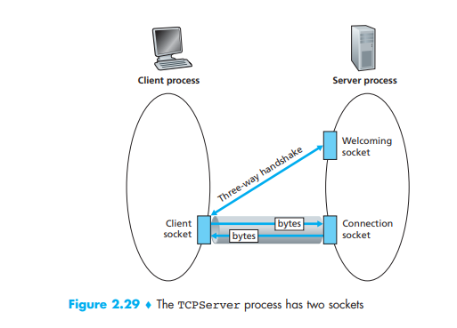

# Socket Programming

In this post, we will write simple client-server programs that use user
datagram protocol (UDP) and transmission control protocol (TCP). Recall that
TCP is connection oriented (meaning that the communicating devices should 
establish a connection before transmitting data and should close the connection
after transmitting the data.) and provides a reliable byte-stream channel.
However, UDP is connectionless and sends independent packets of data from
one end system to the other, without any guarantees about deliver. 

We will use the following simple client-server application to demonstrate socket
programming for both UDP and TCP:

1. The client reads a line of characters (data) from its keyboard and sends
the data to the server.
2. The server receives the data and converts the characters to uppercase
3. The server sends the modified data to the client
4. The client receives the modified data and displays the line on its screen 


## Socket programming with UDP

To test our socket programming, we need client and server. I will run the `udp_client.py`
script in my computer and run `udp_sever.py` in an instance I bought from aliyun
(you could buy one from DigitalOcean or GoogleCloud). To make sure the instance
of cloud server, you need to open the port first as following.


We will login my cloud server and download the `udp_server.py` into a file
called `cs144`, then just run it. The server will start to listen. 

```bash
ssh -p 22 root@47.108.238.80   # my ssh port is 22
wget https://raw.githubusercontent.com/oceanumeric/oceanumeric.github.io/main/src/networking/udp_server.py
python3 udp_server.py  # it should print The server is ready to receive
# when you finish the session, type
exit
```

Then you can run `udp_client.py` on your computer and it will send messages 
to the server and return the strings with upper case. 


=== "udp_client.py"
    ```py
    from socket import * 


    server_name = '47.108.238.80'
    server_port = 12000

    client_socket = socket(AF_INET, SOCK_DGRAM)

    message = input("Please type in lower case: \n")

    client_socket.sendto(message.encode(), (server_name, server_port))

    modified_message, server_address = client_socket.recvfrom(2048)

    print(modified_message.decode())

    client_socket.close()
    ```
=== "udp_server.py"
    ```py
    from socket import * 


    server_port = 12000
    server_socket = socket(AF_INET, SOCK_DGRAM)

    server_socket.bind(('0.0.0.0', server_port))

    print("The server is ready to receive")

    while True:
        message, client_address = server_socket.recvfrom(2048)
        print(message.decode())
        modified_message = message.decode().upper()
        server_socket.sendto(modified_message.encode(), client_address)
    ```

For the function `socket`, the first parameter indicates the address family;
in particular, `AF_INET` indicates that the underlying network is using IPv4.
The second parameter indicates that the socket is of type `SOCK_DGRAM`, which
means it is a UDP socket. 

For a TCP/IP/UDP socket connection, the send and receive buffer sizes define 
the receive window. The receive window specifies the amount of data that 
can be sent and not received before the send is interrupted. If too much 
data is sent, it overruns the buffer and interrupts the transfer. The 
mechanism that controls data transfer interruptions is referred to as 
flow control. If the receive window size for TCP/IP buffers is too small, 
the receive window buffer is frequently overrun, and the flow control 
mechanism stops the data transfer until the receive buffer is empty.

This buffer size is controlled by `recvfrom(2048)`. 

## Socket programming with TCP

Unlike UDP, TCP is a connection-oriented protocol. This means that before the
client and server can start to send data to each other, they first need to
handshake and establish a TCP connection. 



=== "tcp_client.py"
    ```py
    from socket import *


    server_name = '47.108.238.80'
    server_port = 12000  # make sure you opened this port

    client_socket = socket(AF_INET, SOCK_STREAM)

    try:
        # create the connect 
        client_socket.connect((server_name, server_port))
    except:
        print("connection failed")

    message = input("What's you message: \n")

    client_socket.send(message.encode())

    reply_message = client_socket.recv(1024)

    print('From Server: ', reply_message.decode())

    client_socket.close()
    ```
=== "tcp_server.py"
    ```py
    from socket import *

    server_host = 'localhost'  # receive all interface
    server_port = 12000

    with socket(AF_INET, SOCK_STREAM) as stpc:
        stpc.bind((server_host, server_port))  # welcoming socket
        stpc.listen(1)  # listen for TCP connection requests
        print("The server is ready to receive")
        while True:
            connection_socket, addr = stpc.accept()  # create a new socket
            print(f"Connected by {addr}")
            message = connection_socket.recv(1024).decode()
            print(message)
            modified_message = message.upper()
            connection_socket.send(modified_message.encode())
            connection_socket.close()
    ```

## Opening a port on Linux

Typically, ports identify a specific network service assigned to them. This 
can be changed by manually configuring the service to use a different port, 
but in general, the defaults can be used.

The first 1024 ports (Ports 0-1023) are referred to as well-known port 
numbers and are reserved for the most commonly used services include SSH (port 22), 
HTTP and HTTPS (port 80 and 443), etc. Port numbers above 1024 are referred to as ephemeral ports.

Among ephemeral ports, Port numbers 1024-49151 are called the Registered/User 
Ports. The rest of the ports, 49152-65535 are called as Dynamic/Private Ports.

we could use `ss` command to list listening sockets with an open port.

```bash
ss -lntu
```

It gives the following results.

```bash
Netid        State         Recv-Q        Send-Q                    Local Address:Port                Peer Address:Port       Process        
udp          UNCONN        0             0                    172.25.161.18%eth0:68                       0.0.0.0:*                         
udp          UNCONN        0             0                             127.0.0.1:323                      0.0.0.0:*                         
udp          UNCONN        0             0                         127.0.0.53%lo:53                       0.0.0.0:*                         
udp          UNCONN        0             0                                 [::1]:323                         [::]:*                         
udp          UNCONN        0             0                                     *:55896                          *:*                         
udp          UNCONN        0             0                                     *:19286                          *:*                         
udp          UNCONN        0             0                                     *:22313                          *:*                         
tcp          LISTEN        0             4096                          127.0.0.1:9090                     0.0.0.0:*                         
tcp          LISTEN        0             511                           127.0.0.1:9091                     0.0.0.0:*                         
tcp          LISTEN        0             4096                          127.0.0.1:9092                     0.0.0.0:*                         
tcp          LISTEN        0             4096                      127.0.0.53%lo:53                       0.0.0.0:*                         
tcp          LISTEN        0             128                             0.0.0.0:22                       0.0.0.0:*                         
tcp          LISTEN        0             511                                   *:23426                          *:*                         
tcp          LISTEN        0             4096                                  *:22313                          *:*                         
tcp          LISTEN        0             4096                                  *:19286                          *:*                         
tcp          LISTEN        0             4096                                  *:55896                          *:* 
```

We can verify whether a port is being used or not.

```bash
ss -na | grep :4000
```

If it returns _nothing_, then it means the port is not being used. Otherwise,
it should return the status of the port.

```bash
ss -na | grep :55896

udp      UNCONN                 0                   0               *:55896                *:*                                 
tcp      LISTEN                 0                   4096            *:55896                *:* 
```

Ubuntu has a firewall called `ufw`, which takes care of these rules for ports 
and connections, instead of the old `iptables` firewall. If you are a Ubuntu user, 
you can directly open the port using `ufw`

```sh
sudo ufw allow 4000
```

After opening a port, you could test it with `telnet`.

```bash
telnet 47.108.238.80 12000

Trying 47.108.238.80...
Connected to 47.108.238.80.
Escape character is '^]'.
```

This will open the port `4000`. Now, you could test your `tcp_client.py` and
`tcp_server.py` from your computer and your server. 

## Creating a Web server 