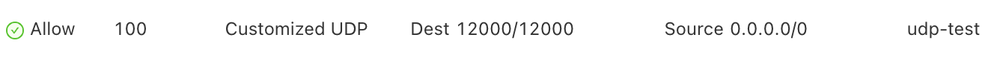

# Socket Programming

In this post, we will write simple client-server programs that use user
datagram protocol (UDP) and transmission control protocol (TCP). Recall that
TCP is connection oriented (meaning that the communicating devices should 
establish a connection before transmitting data and should close the connection
after transmitting the data.) and provides a reliable byte-stream channel.
However, UDP is connectionless and sends independent packets of data from
one end system to the other, without any guarantees about deliver. 

We will use the following simple client-server application to demonstrate socket
programming for both UDP and TCP:

1. The client reads a line of characters (data) from its keyboard and sends
the data to the server.
2. The server receives the data and converts the characters to uppercase
3. The server sends the modified data to the client
4. The client receives the modified data and displays the line on its screen 


## Socket programming with UDP

To test our socket programming, we need client and server. I will run the `udp_client.py`
script in my computer and run `udp_sever.py` in an instance I bought from aliyun
(you could buy one from DigitalOcean or GoogleCloud). To make sure the instance
of cloud server, you need to open the port first as following.



We will login my cloud server and download the `udp_server.py` into a file
called `cs144`, then just run it. The server will start to listen. 

```bash
ssh -p 22 root@47.108.238.80   # my ssh port is 22
wget https://raw.githubusercontent.com/oceanumeric/oceanumeric.github.io/main/src/networking/udp_server.py
python3 udp_server.py  # it should print The server is ready to receive
# when you finish the session, type
exit
```

Then you can run `udp_client.py` on your computer and it will send messages 
to the server and return the strings with upper case. 


=== "udp_client.py"
    ```py
    from socket import * 


    server_name = '47.108.238.80'
    server_port = 12000

    client_socket = socket(AF_INET, SOCK_DGRAM)

    message = input("Please type in lower case: \n")

    client_socket.sendto(message.encode(), (server_name, server_port))

    modified_message, server_address = client_socket.recvfrom(2048)

    print(modified_message.decode())

    client_socket.close()
    ```
=== "udp_server.py"
    ```py
    from socket import * 


    server_port = 12000
    server_socket = socket(AF_INET, SOCK_DGRAM)

    server_socket.bind(('0.0.0.0', server_port))

    print("The server is ready to receive")

    while True:
        message, client_address = server_socket.recvfrom(2048)
        print(message.decode())
        modified_message = message.decode().upper()
        server_socket.sendto(modified_message.encode(), client_address)
    ```

For the function `socket`, the first parameter indicates the address family;
in particular, `AF_INET` indicates that the underlying network is using IPv4.
The second parameter indicates that the socket is of type `SOCK_DGRAM`, which
means it is a UDP socket. 

For a TCP/IP/UDP socket connection, the send and receive buffer sizes define 
the receive window. The receive window specifies the amount of data that 
can be sent and not received before the send is interrupted. If too much 
data is sent, it overruns the buffer and interrupts the transfer. The 
mechanism that controls data transfer interruptions is referred to as 
flow control. If the receive window size for TCP/IP buffers is too small, 
the receive window buffer is frequently overrun, and the flow control 
mechanism stops the data transfer until the receive buffer is empty.

This buffer size is controlled by `recvfrom(2048)`. 

## Socket programming with TCP
