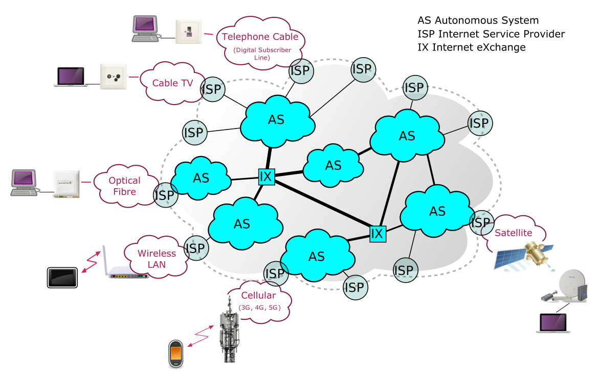
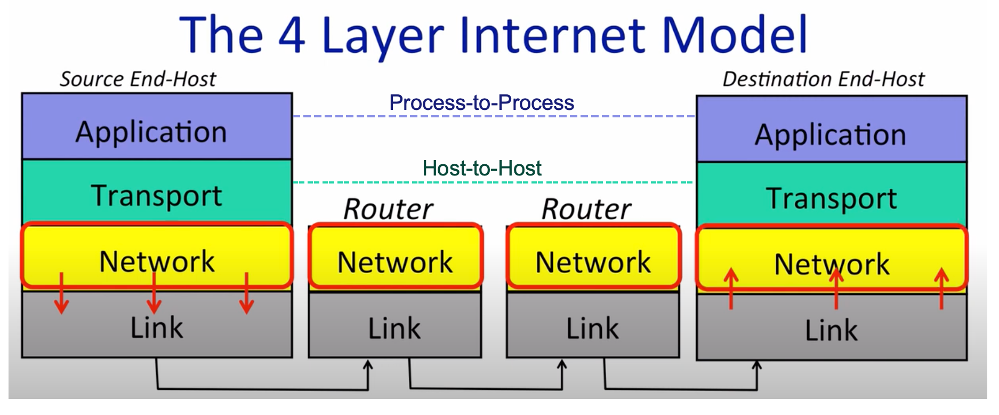
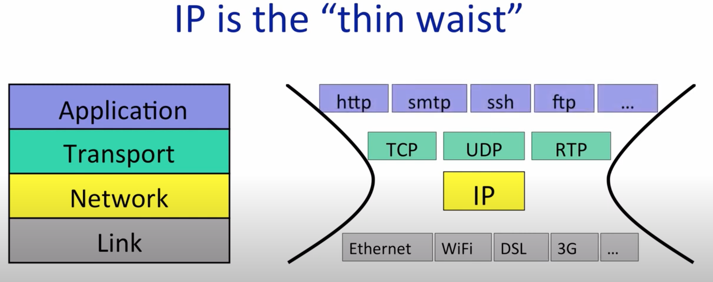
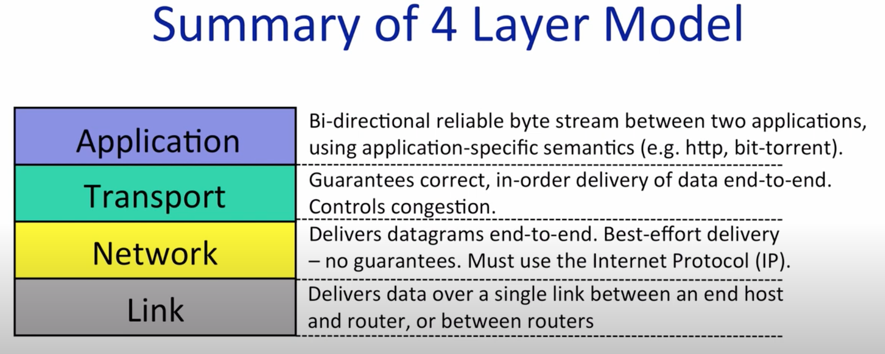
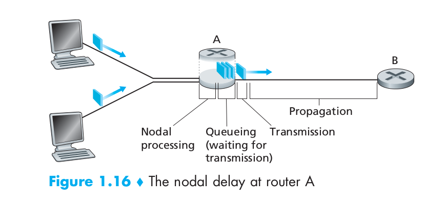
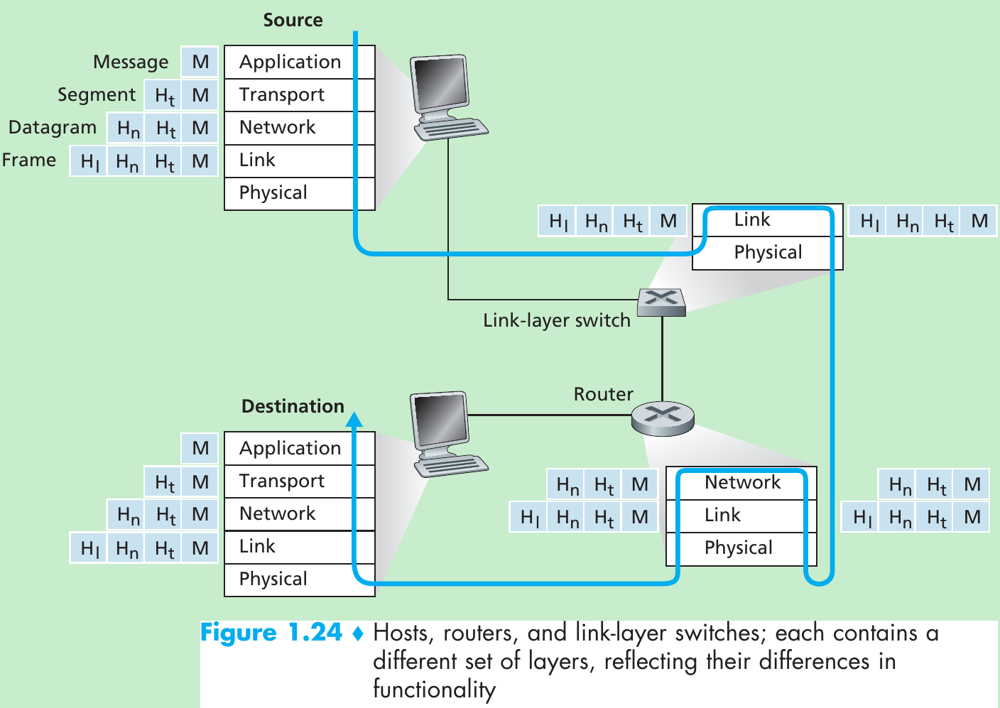
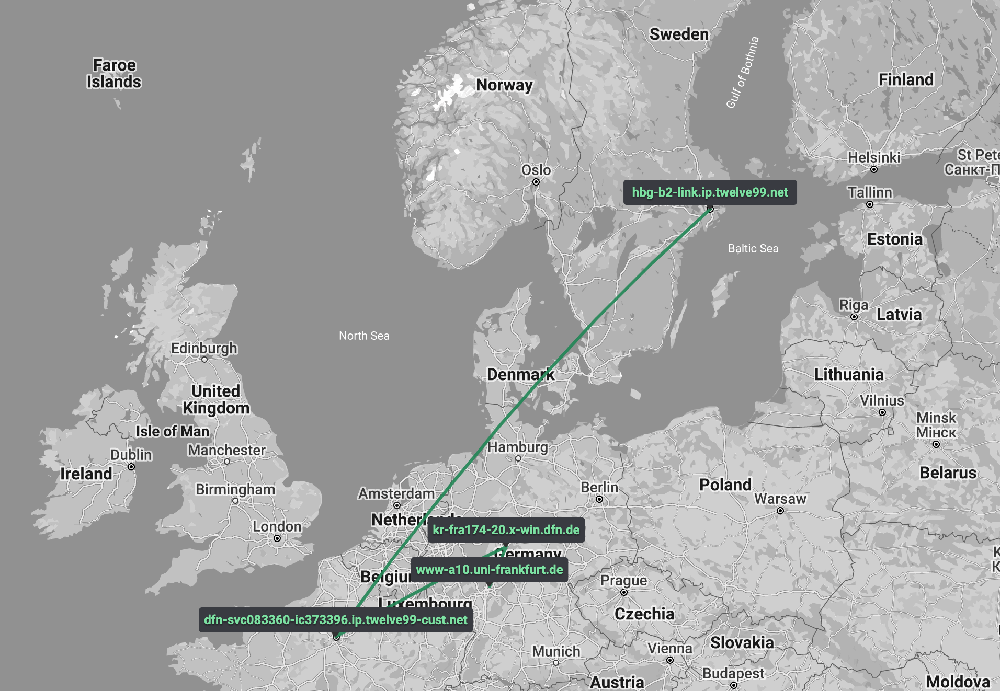

## What Is The Internet? 

The internet is a computer network that interconnects billions of computing
devices throughout the world. Here is a simplified structure of the internet. 



All the devices (host or end systems) are connected together by a network of
__communication links__ and __packet switches__. A packet switch takes a packet
arriving on one of its incoming communication links and forwards that packet
on one of its outgoing communication links. 

End systems, packets switches, and other pieces of the Internet run protocols
that controls the sending and receiving of information within the internet. The
__Transmission Control Protocol (TCP)__ and the __Internet Protocol (IP)__ are
two of the most important protocols in the Internet. Those protocols are collectively
known as __TCP/IP__. 

Internet standards are developed by by the Internet Engineering Task Force (IETF).
The IETF standards documents are called __requests for comments (RFCs)__. 

End systems attached to the Internet provide a __socket interface__ that specifies
how a program running on one end system asks the Internet infrastructure to
deliver data to a specific destination program running on another end system. 


## The 4 Layer Internet Model

The internet was built upon 4 layers mixed with __hardware__ and __software__ 
infrastructures. Each layer has its own __protocols__ and could only communicate
with its peer layers. It is also important to know that the _link layer_ sends
datagram to each other and those link layers work in different ways (such as Wifi
and Ethernet). However, the modularity design of _network_ and _link layer_ makes
the 'communication' possible, which we will learn it in more detail later.  

=== "The 4 layer model"
    
    The link layer follows the physical law about how 'information' (bits) could
    be transferred. In this series of posts, we will focus on the first three
    layers - application, transport, and network. 

=== "The network layer"
    In this layer, we must use the __Internet Protocol (IP)__. 

    - IP makes a best-effort attempt to deliver our datagrams to the other end.
    But it makes no promises. 
    - IP datagrams can get lost, can be delivered out of order, and can be
    corrupted. There are no guarantees. 

=== "IP: the 'thin waist' "
    


=== "Summary"
    


## Packet Switching 

To send a message from a source end system to a destination end system, the
source breaks long message into smaller chunks of data known as packets. Between
source and destination, each packet travels through communication links and
__packet switches__(for which there are two predominant types, routers and
link-layer switches).

Most packet switches uses __store-and-forward transmission__ at the inputs to 
the links. 


## Delay, Loss and Throughout 

If a source and system or a packet switch is sending a packet of $L$ bits over
a link with transmission rate $R$ bits/sec, then the time to transmit the
packet is $L/R$ seconds. Let now consider the general case of sending one
packet from source to destination over a path consisting of $N$ links each of
rate $R$. We can calculate the end-to-end delay is:

$$d_{end-to-end} = N \frac{L}{R}$$

In addition to the store-and-forward delays, packets suffer output buffer
__queuing delays__. When arriving packet finds that the buffer is completely 
full with other packets waiting for transmission, the __packet loss__ will occur. 

The most important of these delays are the __nodal processing delay, queueing delay__,
__transmission delay__, and __propagation delay__. 



If we let $d_{proc}, d_{queue}, d_{trans}$ and $d_{prop}$ denote the processing,
queuing, transmission, and propagation delays, then the total nodal delay is
given by

$$d_{nodal} = d_{proc} + d_{queue} + d_{trans} + d_{prop}$$

In addition to delay and packet loss, another critical performance measure in
computer networks is end-to-end throughout. The __instantaneous throughout__
at any instant of time is the rate (in bits/sec) at which host B is receiving
the file. 

Therefore, good quality of internet means: low delays and higher throughout rate. 


## Protocol Layers and Their Service Models 


To provide structure to the design of network protocols, network designers 
organize protocols - and the network hardware and software that implement 
the protocols - in __layers__. All those layers are encapsulated into a long
message with different headers. 



## Traceroute


```bash
traceroute to google.com (216.58.212.142), 30 hops max, 60 byte packets
 1  #.#.#.# (my home router)  1.745 ms  1.718 ms  1.708 ms
 2  #.#.#.# (my IP)  30.367 ms  3.940 ms  4.112 ms
 3  * * *
 4  7111a-mx960-01-ae10-1130.fra.unity-media.net (81.210.137.144)  20.118 ms  20.118 ms  20.072 ms
 5  de-fra04d-rc1-re0-aorta-net-ae-7-0.aorta.net (84.116.197.245)  23.883 ms  22.485 ms  29.097 ms
 6  84.116.190.94 (84.116.190.94)  25.674 ms  13.559 ms  17.805 ms
 7  74.125.48.122 (74.125.48.122)  26.587 ms  24.558 ms  34.028 ms
 8  * * *
 9  108.170.252.1 (108.170.252.1)  33.965 ms 142.250.214.200 (142.250.214.200)  32.011 ms 172.253.71.88 (172.253.71.88)  31.930 ms
10  108.170.252.18 (108.170.252.18)  33.757 ms 142.250.46.245 (142.250.46.245)  33.806 ms 108.170.252.19 (108.170.252.19)  31.567 ms
11  ams15s21-in-f14.1e100.net (216.58.212.142)  31.501 ms  26.350 ms  20.266 ms
```

Here is an example of visualization about how information travels.




__References__

Kurose, J. F., & Ross, K. W. (2022). Computer Networking: A Top-Down Approach
Eight Edition. _Addision Wesley_.

???cite
    ```
    @article{kurose2022computer,
    title={Computer Networking: A Top-Down Approach Eighth Edition},
    author={Kurose, James F and Ross, Keith W},
    journal={Addision Wesley},
    year={2022}
    }
    ```

