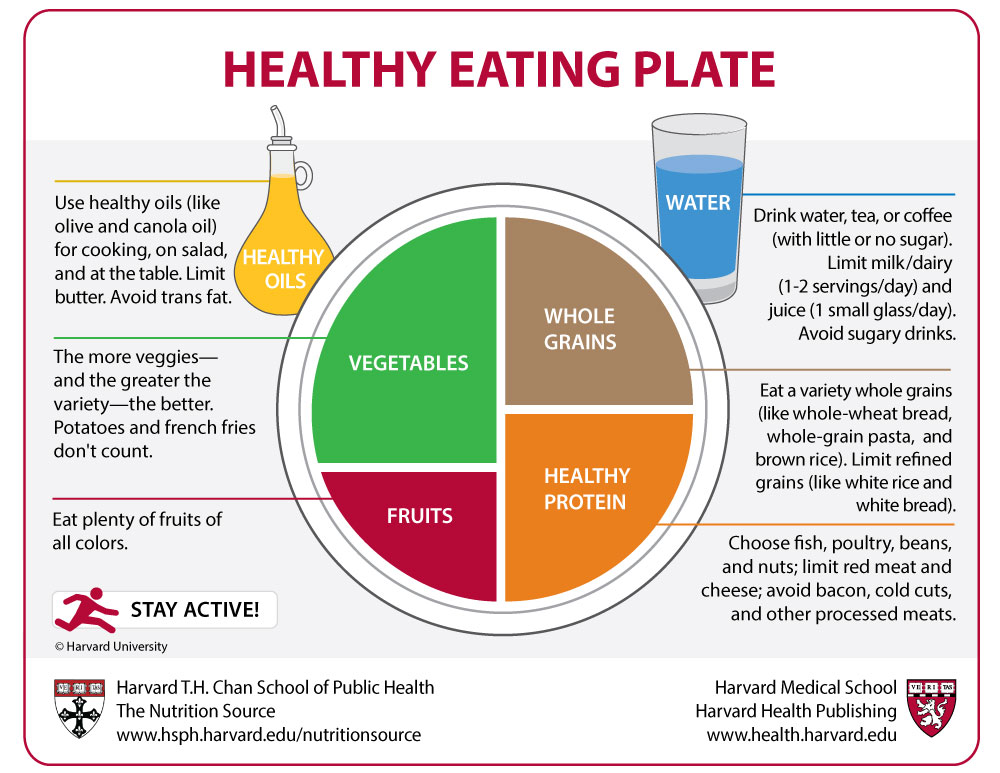

When it comes to having a diet plan, there are many choices. Here is a list
of diet plans that are quite well known: 

* The Mediterranean Diet
* Cambridge Weight Plan
* The Copenhagen Diet
* Atkins Diet
* The ketogenic Diet

Almost all those diets claim that the diet works well for everyone. However,
this is simply too good to be true[^1]. When you want to loose weight in a very
short time, there might be the risk of triggering a healthy issue. Therefore,
the best way of having diet is to have a balanced diet with low calorie. 

So, what is a balanced plate then? You could use the following formula. 

What kind of food are low calorie? Most of fruit like apple, orange, and watermelon,
are low calories. Of filling food, oats, eggs, and fish are low calories. The 
bottom line is that you need to mix your food with:

* vegetables
* meet (fish is better)
* carbohydrates
* and east less sugar and salt

Of course, you also need to do exercise, which is very important. If you are still
not motivated, maybe you should read the following study. 

Andersen, E., Juhl, C. R., Kjøller, E. T., Lundgren, J. R., Janus, C., Dehestani,
Y., ... & Barrès, R. (2022). Sperm count is increased by diet-induced 
weight loss and maintained by exercise or GLP-1 analogue treatment: 
a randomized controlled trial. _Human Reproduction_.
https://doi.org/10.1093/humrep/deac096

[^1]:
    For instance, Harvard Health Publishing states that ketogenic diet actually
    comes with serious risks. See this [post](https://www.health.harvard.edu/staying-healthy/should-you-try-the-keto-diet). 