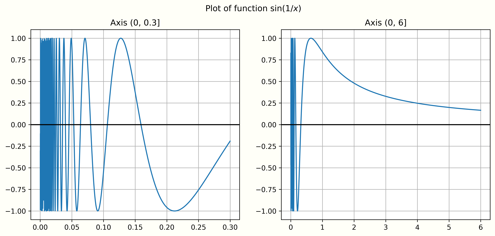

Having established the fundamentals of real and complex numbers in the last
post, in this post, we will review key concepts of calculus in complex domain. 

## Continuity and Limits

__Definition 1.1__ Let $X$ be a nonempty subset of $C$, let $f: X \to C$ be a
function, and let $a$ be a point in $X$. To say that $f$ is _continuous_ at $a$
means that one of the following conditions hold:

1. (_sequential continuity_) For every sequence $z_n$ in $X$ such that
$\lim_{n \to \infty} z_n = a$, we have that $\lim_{n \to \infty} f(z_n) = f(a)$. 

2. ($\epsilon$-$\delta$ continuity) For every $\epsilon > 0$, there exists some
$\delta(\epsilon) > 0$ such that if $|z - a| < \delta(\epsilon)$, then
$|f(z)-f(a)| < \epsilon$. 

To say $f$ is _continuous_ on $X$ means that $f$ is continuous at $a$ for all
$a \in X$. 

__Theorem 1.2__ Let $X$ and $Y$ be _metric space_. Let $f: X \to Y$ be a function,
and let $a$ be a point in $X$. Then $f$ is sequentially continuous at $a$ if and
only if $f$ is $\epsilon$-$\delta$ continuous at $a$. 

We will find both the sequential and $\epsilon$-$\delta$ continuity continuity
to be useful for different purposes. For example, $\epsilon$-$\delta$ continuity
will later be useful when considering the properties of a continuous function
over an entire interval. Conversely, sequential continuity makes the proof of
the algebraic properties of continuity straightforward. 

__Theorem 1.3__ Let $X$ be a subset of $C$. Let $f, g : X \to C$ be functions,
and for some $a \in X$, suppose that $f$ and $g$ are continuous at $a$. Then:

1. for $c \in C$, $cf(z)$ is continuous at $a$.
2. $f(z) + g(z)$ is continuous at $a$.
3. $\overline{f(z)}$ is continuous at $a$
4. $f(z)g(z)$ is continuous at $a$
5. if $g(z) \neq 0$ for all $z in X$, then $f(z)/g(z)$ is continuous at $a$. 

__Theorem 1.4__ Let $X, Y$ and $Z$ be _metric spaces_, let $f: X \to Y$ and 
$g : Y \to Z$ be functions, let $a$ be a point in $X$, and suppose that $f$
is continuous at $a$ and $g$ is continuous at $f(a)$. Then $g \circ f$ is
continuous. 

__Example 1.5__ For $X = R$ or $C$, any polynomial function $p: X \to X$ is
continuous. 

__Definition 1.6__ Let $X$ be a nonempty subset of $C$ and let $f: X \to C$ be a
function. To say $f$ is _uniformly continuous_ on $X$ means that for every
$\epsilon > 0$, there exists some $\delta(\epsilon) >0$ such that if $z, w \in X$
and $|z - w| < \delta(\epsilon)$, then $|f(z) - f(w)| < \epsilon$. 

!!! note
    Uniform continuity on $X$ is therefore generally a stricter condition than
    continuity on $X$, as the "degree of continuity" $\delta(\epsilon)$ is
    no longer allowed to vary with $a$ (point-by-point). Obviously if a function is uniformly 
    continuous it is continuous. But not necessarily vice versa—sometimes the
    function is such that the $\delta$ must depend on the actual point you’re going to.

__Example 1.7__ The function $g(x) = \sqrt{x}$ is uniformly continuous on $[0, \infty]$.
For given $\epsilon$, let $\delta = \epsilon^2$, then if $|x - c| < \delta = \epsilon^2$,
we have $-\delta < x -c < \delta$. It gives

\begin{aligned}
& x <  c + \delta = c + \epsilon^2 < (\sqrt{c} + \epsilon)^2 \implies \sqrt{x} < \sqrt{c} + \epsilon  \\
& x > c - \delta \implies \sqrt{x} > \sqrt{c} + \epsilon 
\end{aligned}

This means we have $|\sqrt{x} - \sqrt{c}| < \epsilon$. So $|g(x) - g(c)| < \epsilon$,
which gives the uniformly continuous. 

__Example 1.8__ The function $g(x) = \sin(\frac{1}{x})$ is not uniformly continuous
on $(0, 1)$. This is because the function oscillates so fast that for any 
$\delta$ you might pick, there is an x close to zero so that the interval 
$(x, x+\delta)$ contains an entire “period” of the function, and gets outside of 
any $\epsilon$ range whenever $\epsilon < 1$ (see the following figure). 

__Theorem 1.9__ If $X$ is a closed and bounded subset of $C$ and $f: X \to C$ is
continuous, then $f$ is _uniformly continuous_ on $X$. 

_Proof._ Assume otherwise. Then for _some_ $\epsilon > 0$ and _every_ $\delta > 0$
there exists $x, y$ such that $|x-y| < \delta$ but $|f(x) - f(y)| > \epsilon$. 
For $\delta=1 / n$ choose such an $x$ and $y$ and call them $x_{n}$ and $y_{n}$ 
respectively. Since the interval of interest is closed and bounded, there is a 
subsequence $\{x_{n_{k}}\}$ of $\{x_{n}\}$ that converges. Call its limit $c$. 
Certainly $c \in[a, b]$. And we have,

$$|y_{n_{k}}-c|=|y_{n_{k}}-x_{n_{k}}+x_{n_{k}}-c|<|y_{n_{k}}-x_{n_{k}}|+|x_{n_{k}}-c|$$

and both terms go to zero, so the $y_{n_{k}}$ also converge to $c$. Now 

\begin{aligned}
|f(x_{n_{k}})-f(c)| & =|f(x_{n_{k}})-f(y_{n_{k}})+f(y_{n_{k}})-f(c)|  \\
                    & \geq|f(x_{n_{k}})-f(y_{n_{k}})|-\mid f(y_{n_{k}})-f(c)| \\
                    & \geq \epsilon-| f(y_{n_{k}})-f(c) 
\end{aligned}

If $f$ were continuous at $c$, both terms in absolute values would go to zero, raising a contradiction. So $f$ is not continuous.
&#9726;
 

__Theorem 1.10__ (Extreme Value Theorem). Let $X$ be a closed and bounded subset
of $C$, and let $f: X \to R$ be continuous. Then $f$ attains both _absolute maximum_
and an _absolute minimum_ on $X$; that is, there exit $c, d \in X$ such that
$f(c) \leq f(z) \leq f(d)$ for all $z \in X$. 

__Corollary 1.11__ Let $X$ be a closed and bounded subset of $C$, and let $f: X \to C$
be continuous. Then $f$ is _bounded_. 

!!! note
    When the function is continuous, the map of $X$ should be bounded too whenever
    $X$ is closed and bounded. 

__Definition 1.12__ Let $X$ be a nonempty subset of $C$, let $f: X \to C$ be a
function, and let $a$ be a limit point of $X$. To say that $\lim_{z \to a} f(z) = L$
means that one of the following conditions holds:

* (Sequential limit) For every sequence $z_n$ in $X$ such that $\lim_{n \to \infty} = a$
and $z_n \neq a$ for all $n$, we have that $\lim_{n \to \infty} f(z_n) = L$. 

* ($\epsilon$-$\delta$ limit) For every $\epsilon > 0$, there exists some $\delta(\epsilon) > 0$
such that $|z - a| < \delta(\epsilon)$ and $z \neq a$, then $|f(z)- L| < \epsilon$.  

## Differentiation 

__Definition 2.1__ Let $X$ be a subset of $C$ such that every point of $X$ is
a limit point of $X$, and let $f: X \to C$ be a function, and let $a$ be a point
in $X$. To say that $f$ is _differentiable_ at $a$ means that the limit

$$f'(a) = \lim_{z \to a} \frac{f(z)-f(a)}{z-a} = \lim_{h \to 0} \frac{f(a+h) - f(a)}{h}$$

exists (where $h = z-a$). To say that $f$ is _differentiable_ on $X$ means that
for all $a \in X$, $f$ is differentiable $a$; and to say that $f$ is _continuously differentiable_
on $X$ means that $f$ is differentiable on $X$ and $f' : X \to C$ is continuous. 

This definition could lead to the _local linearity_ as follows:

$$f(z) \approx f(a) + f'(a) (z-a)$$

## The Riemann Integral 

__Definition 3.1__ A _partition_ $P$ of $[a, b]$ is a finite subset $\{x_0, \cdots, x_n\} \subset [a, b]$
such that $a = x_0 < x_1 \cdots < x_{n-1} < x_n = b$. We call $[x_{i-1}, x_i]$ the
$i$th _subinterval_ of $P$, and we use the abbreviation $(\Delta x)_i = x_i - x_{i-1}$.
We assume define $v: [a, b] \to R$ be real-valued and bounded, which represents 
the area of a rectangle. 

__Definition 3.2__ Let $P = \{x_0, \cdots, x_n \}$ be a partition of $[a, b]$.
Since we continue to assume that $v(x)$ is bounded, we can define

\begin{align}
M(v; P, i) & = \sup \{v(x) | x \in [x_{i-1}, x_i] \} \\
m(v; P, i) & = \inf \{v(x) | x \in [x_{i-1}, x_i] \} 
\end{align}

We define the _upper Riemann sum_ $U(v; P)$ to be 

$$U(v; P) = \sum_{i=1}^n M(v; P, i) (\delta x)_i$$

and we define the lower Riemann sum $L(v; P)$ to be 

$$L(v; P) = \sum_{i=1}^n m(v; P, i) (\delta x)_i$$

__Definition 3.3__ Let $\mathcal{P}$ be the set of all partitions of $[a, b]$. We define
the _upper Riemann integral_ and _lower Riemann integral_ of $v$ on $[a, b]$
to be 

\begin{align}
\overline{\int_a^b} v(x) dx & = \inf \{ U(v; P) | P \in \mathcal{P} \} \\
\underline{\int_a^b} v(x) dx & = \sup \{ L(v; P) | P \in \mathcal{P} \} 
\end{align}

respectively. 

__Definition 3.4__ Let $f: [a, b] \to C$ be bounded, and let $u$ and $v$ be the
real and imaginary parts of $f$. To say that $f$ is integrable means that both
$u$ and $v$ are integrable, in which case we define 

$$\int_a^b f(x) dx = \int_a^b u(x) dx + i \int_a^b v(x) dx $$

!!! note
    The properties of integration in complex number $C$ are almost same with
    that of real valued number $R$. Therefore, we will not list them here. 

__Theorem 3.5__ If $f, g:[a, b] \rightarrow \mathbf{C}$ are integrable, 
then $|f(x)|, f(x)^{2}$, and $f(x) g(x)$ are also integrable on $[a, b]$. 
If we also assume $f$ and $g$ are real-valued, then $\min (f(x), g(x))$ 
and $\max (f(x), g(x))$ are integrable on $[a, b]$. Furthermore, for 
both real- and complex-valued integrable functions $f$,

$$
\left|\int_{a}^{b} f(x) d x\right| \leq \int_{a}^{b}|f(x)| d x .
$$

It may be helpful to think of Theorem 3.5 s an integral analogue of the 
triangle inequality, in that the triangle inequality can be used to 
give an upper bound to the absolute value of a sum, whereas Theorem 3.5 
is used to give an upper bound to the absolute value of an integral.

## The Fundamental Theorem of Calculus 

Our complex-fixed review/recovery/reboot of calculus now culminates 
in the Fundamental Theorems of Calculus. First, we need two definitions.

__Definition 4.1__ For $b<a$, if $f(x)$ is integrable on $[b, a]$, we define 
the symbol $\int_{a}^{b} f(x) d x$ to be

$$
\int_{a}^{b} f(x) d x=-\int_{b}^{a} f(x) d x
$$

In other words, an integral "traveled backwards" is defined to be the negative 
of the corresponding forwards integral. We also define

$$
\int_{a}^{a} f(x) d x=0
$$

__Definition 4.2__ Let $I$ be a subinterval (not necessarily closed) 
of $\mathbf{R}$. For $f: I \rightarrow \mathbf{C}$ such that $f$ is 
integrable on any closed subinterval of $I$, we define an indefinite 
integral of $f$ to be any function of the form

$$
F(x)=\int_{a}^{x} f(t) d t
$$

where $a \in I$ is fixed.

__Theorem 4.3__ (FTC I). Let I be an interval, $a \in I$, 
let $f: I \rightarrow \mathbf{C}$ be integrable on any 
closed subinterval of I, and let

$$
F(x)=\int_{a}^{x} f(t) d t .
$$

Then $F$ is (uniformly) continuous on $I$, and furthermore, if $f$ is 
continuous at some $b \in I$, then $F$ is differentiable at $b$ and $F^{\prime}(b)=f(b)$.

__Theorem 4.4__ (FTC II). Let $F:[a, b] \rightarrow \mathbf{C}$ be continuously 
differentiable. Then

$$
F(b)-F(a)=\int_{a}^{b} \frac{d F}{d x} d x .
$$

One familiar and useful consequence of FTC II is integration by substitution, 
which we state as follows.

__Theorem 4.5__ Let $X$ be a subset of $\mathbf{C}$, and 
let $u:[a, b] \rightarrow X$ and $f: X \rightarrow \mathbf{C}$ be continuously 
differentiable. Then

$$
\int_{a}^{b} f^{\prime}(u(x)) u^{\prime}(x) d x=f(u(b))-f(u(a))
$$

If we further assume that $X$ is a subinterval of $\mathbf{R}$ and 
$g: X \rightarrow \mathbf{C}$ is continuous, then

$$
\int_{a}^{b} g(u(x)) u^{\prime}(x) d x=\int_{u(a)}^{u(b)} g(u) d u
$$

__Theorem 4.6__ (Integration by parts). Let 
$f, g:[a, b] \rightarrow \mathbf{C}$ be continuously differentiable. Then

$$
\int_{a}^{b} f(x) g^{\prime}(x) d x=f(b) g(b)-f(a) g(a)-\int_{a}^{b} g(x) f^{\prime}(x) d x
$$

__Theorem 4.7__ (L'Hôpital's Rule). Let $f$ and $g$ be real-valued 
differentiable functions on some $X \subseteq \mathbf{R}$ such 
that $g^{\prime}(x) \neq 0$ for all $x \in X$ and $g(x)$ is 
strictly monotone (i.e., either strictly increasing or strictly decreasing) on $X$.

* If $X=(a, b)$ and for some $L \in \mathbf{R}$,

$$
\lim _{x \rightarrow a^{+}} f(x)=0, \quad \lim _{x \rightarrow a^{+}} g(x)=0, \quad \lim _{x \rightarrow a^{+}} \frac{f^{\prime}(x)}{g^{\prime}(x)}=L,
$$

then $\lim _{x \rightarrow a^{+}} \frac{f(x)}{g(x)}=L$

* If $X=(a,+\infty)$ and for some $L \in \mathbf{R}$,

$$
\lim _{x \rightarrow+\infty} f(x)=+\infty, \quad \lim _{x \rightarrow+\infty} g(x)=+\infty, \quad \lim _{x \rightarrow+\infty} \frac{f^{\prime}(x)}{g^{\prime}(x)}=L
$$

then $\lim _{x \rightarrow a^{+}} \frac{f(x)}{g(x)}=L$. 