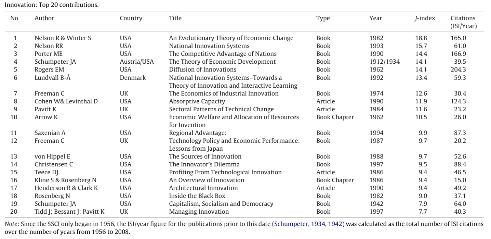
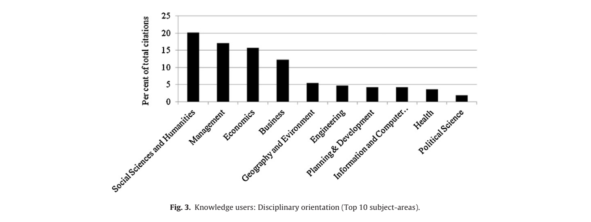
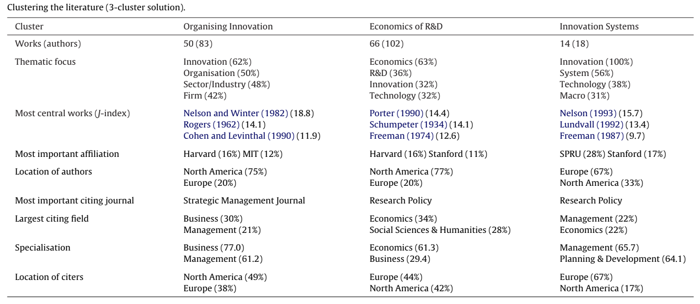

<style>
    .md-content > .md-typeset {
        font-size: 13pt;
    }
    .md-typeset h2 {
        margin-top: 1em;  /* keep it 1em for markdown */
    }
</style>

## Introduction 

Newcomers in innovation research like me may feel overwhelmed by the knowledge
booming in this field. I have been searching for a roadmap to navigate 
my research work for a while. Luckily for me, I got one paper that 
explores the knowledge base of innovation (Fagerberg et al 2012). 
In this post, I will summarize this paper. 


## Motivation 

Authors in this paper tried to explore the knowledge base of an emerging
discipline, namely "innovations studies", which may be defined as the scholarly
study of how innovation takes place and what the important explanatory factors
and economic and social consequences are. 

Since there are thousands of academics worldwide doing research in innovation,
it is important to identify the core contributions to the literature on innovation,
as well as the users of this literature, and to analyze the structure of the
knowledge base in this area. 


## Key Ideas 

### Top 20 contributions

The bibliometrics analysis shows that most of the top contributions are books,
which include those well known ones like _The Theory of Economic Development_ by
Schumpeter and _The Innovator's Dilemma_ by Christense. 
{: .zoom}

This table is very valuable for me as I could read those classical ideas to
understand innovation in a deep way. 

### Top users 

Many scholars are interested in innovation. However, the impact of innovation
study is still small outside of the field of business and economics. 
{: .zoom}

### Structure of the knowledge base

Based on the characteristics of literature, authors group them into three
clusters:

* organizing innovation
* Economics of R&D
* innovation system

Here is the table of core contributions for each cluster. 
{: .zoom}

### The evolution of the core literature

Before the 1970s, studies about innovation are not very related as original 
ideas were developed by big thinkers individually. This state of affairs changed
during the 1970s and 1980s. An organization called Science Policy Research Unit
(SPRU) led by Chris Freeman began to combine different ideas into a coherent
framework in this book _The Economics of Industrial Innovation_. After 1990,
the development of research in this area takes a new twist. While much of the
previous work had focused on innovation in firms and industries, some of the
attention now shifted towards the role of innovation in the entire economy, and
how institutions and policies might be adjusted so that society could enjoy the
full benefits of innovation and its diffusion. 

## What I Have Learned 

I got a lot from this reading as it gives a roadmap to do research in this field.
It also helps me to narrow down my research area: organizing innovation. This
means that I will focus on studying innovation in firms and industries. 

This paper can also serve as an example of doing systematic review. In the future,
I will definitely turn to it when I want to identify the core literature in my
field. 

## Reference

Fagerberg, J., Fosaas, M. and Sapprasert, K. (2012). Innovation: Exploring the 
knowledge base. _Research policy, 41(7)_, 1132-1153.
[:fontawesome-solid-file-pdf:](https://drive.google.com/file/d/1WnrtUpfPLWq7GIvzSTDrFdiX-n65XoEA/view?usp=sharing) 
https://doi.org/10.1016/j.respol.2012.03.008
??? cite "BibTex"
    ```
    @article{fagerberg2012innovation,
    title={Innovation: Exploring the knowledge base},
    author={Fagerberg, Jan and Fosaas, Morten and Sapprasert, Koson},
    journal={Research policy},
    volume={41},
    number={7},
    pages={1132--1153},
    year={2012},
    publisher={Elsevier}
    }
    ```


In case, you found this post useful, please cite as:
??? cite
    Wang, F. (2022). Roadmap for Researchers in Innovation [web blog]. Retrieved {{ git_site_revision_date_localized }}, from https://oceanumeric.github.io/readings/2022/innovation-research-roadmap/. 


<nav class="md-tags"> 
    <span class="md-tag">Innovation</span> 
    <span class="md-tag">New scientific fields</span> 
    <span class="md-tag">Specialisms</span>
    <span class="md-tag">Bibliometrics</span> 
</nav>